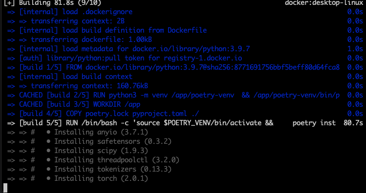
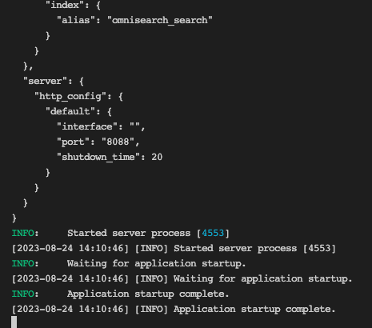

### Python-Vector-Search Project based on Python-Fastapi
- We use Facebook AI Similarity Search (FAISS) to efficiently search for similar text. Finding items that are similar is commonplace in many applications. Perhaps you want to find products in your store that match the description input by a customer. Or perhaps you want to find related questions
- A vector or an embedding is a numerical representation of text data. For example, using an embedding framework, text like ‘name’ can be transformed into a numerical representatio
- Semantic search consists of retrieving texts whose meaning matches a search query. For example, if your search query is “car,” the retrieved texts could include words such as “car,” “automobile,” “vehicle,” and so on. In contrast, keyword search only returns text passages with words of the search query.
- The results of a semantic search are the texts whose embeddings are most similar to the query's embedding (https://blog.dataiku.com/semantic-search-an-overlooked-nlp-superpower?ref=dylancastillo.co)

Install Poerty
```
https://python-poetry.org/docs/?ref=dylancastillo.co#installing-with-the-official-installer
```

Using Poetry: Create the virtual environment in the same directory as the project and install the dependencies:
```
poetry config virtualenvs.in-project true
poetry init
poetry add faiss-cpu
poetry add sentence-transformers
```

Using Poetry: Poetry install when buding the project initially
```
poetry install
```

Using venv and pip: Create a virtual environment and install the dependencies listed in requirements.txt:
```
python -m venv .venv && source .venv/bin/activate
pip install -r requirements.txt
```

### Poetry Enviroment
Install Poerty to Dockerfile as build
```
FROM --platform=linux/amd64 python:3.9.7 as build
ARG DEBIAN_FRONTEND=noninteractive

# Configure Poetry
ENV POETRY_VERSION=1.3.2
ENV POETRY_HOME=/app/poetry
ENV POETRY_VENV=/app/poetry-venv
ENV POETRY_CACHE_DIR=/app/.cache

# Install poetry separated from system interpreter
RUN python3 -m venv $POETRY_VENV \
	&& $POETRY_VENV/bin/pip install -U pip setuptools \
	&& $POETRY_VENV/bin/pip install poetry==${POETRY_VERSION}

# Add `poetry` to PATH
ENV PATH="${PATH}:${POETRY_VENV}/bin"

WORKDIR /app

# Copy Dependencies
COPY poetry.lock pyproject.toml ./

RUN /bin/bash -c 'source $POETRY_VENV/bin/activate && \
    poetry install'

```

Install Poerty to Dockerfile as runtime
```
FROM --platform=linux/amd64 python:3.9.7 as runtime

# Configure Poetry
# ENV POETRY_VERSION=1.3.2
# ENV POETRY_VENV=/app/poetry-venv

WORKDIR /app
#COPY --from=indexing_environment $POETRY_VENV $POETRY_VENV
COPY --from=build /app .
COPY . ES-Services

EXPOSE 7000
ENTRYPOINT ["/app/ES-Services/docker-run-entrypoints.sh"]
```

## Docker build
```
docker build \
  -f "$(dirname "$0")/Dockerfile" \
  -t fn-vector-search-api:es \
  --target build \
  "$(dirname "$0")/."
```


## Docker run
```
docker run --rm --platform linux/amd64 -it -d \
  --name fn-vector-search-api --publish 7000:7000 --expose 7000 \
  --network bridge \
  -v "$SCRIPTDIR:/app/FN-BEES-Services/" \
  fn-vector-search-api:es
```

## services_start.sh for local env
```
#!/bin/bash
set -e

SCRIPTDIR="$( cd -- "$(dirname "$0")" >/dev/null 2>&1 ; pwd -P )"

cd $SCRIPTDIR
source .venv/bin/activate
uvicorn main:app --reload --port=7000 --workers 4
```
